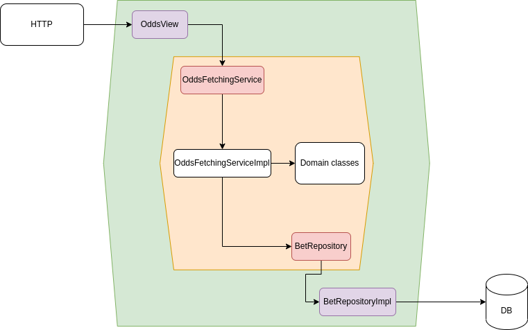

# BETinho, o site de apostas 💰

Projeto relacionado à disciplina Prática em Desenvolvimento de Software 2022/01 da UFMG

  
Proposta 

Inspirado em plataformas como o [bet365](https://pt.wikipedia.org/wiki/Bet365) e o [sportsBet](https://en.wikipedia.org/wiki/Sportsbet), a equipe desenvolverá um site que permite aos seus usuários realizarem apostas online. O nosso site permitirá o cadastro de cenários de aposta (e.g.: cadastrar um cenário referente a um jogo entre Cruzeiro e Atlético) e registrar as apostas de usuários (e.g: apostar $50 que o Cruzeiro será vencedor). Além disso, cuidará do cálculo das chances e prêmios envolvidos nas apostas.

O site **não** realizará sorteios. Ele apenas permitirá apostas.

## 👥 Equipe

- Bárbara Ribeiro ([@barbaragribeiro](https://github.com/barbaragribeiro)) - Desenvolvedora Fullstack
- Jean George ([@jeangeorge](https://github.com/jeangeorge)) - Desenvolvedor Fullstack
- João Pedro Renan ([@jotarenan](https://github.com/jotarenan)) - Desenvolvedor Fullstack
- Luiz Berto ([@luiz787](https://github.com/luiz787)) - Desenvolvedor Fullstack

## 🚀 Tecnologias

- Backend: Python, usando o framework Django
- Frontend: Typescript, usando a biblioteca React
- Banco de Dados: MySQL

  

    <h2>✍ Descrição do MVP</h2>
  

  
  O MVP do BETinho visa validar se é possível e se há interesse em utilizar o meio virtual para se realizar apostas. A nossa hipótese é de que essa demanda existe, pois apostas são uma forma de diversão e entretenimento constante na sociedade, e formas de acesso ao ambiente virtual tornaram-se ubíquas. 
  
  Para isso, tomaremos as principais características encontradas em sistemas de apostas tradicionais e as reproduziremos em um site. Os tradicionais clubes de apostas em partidas esportivas, como futebol e corridas de cavalos, são a nossa principal referência.
  
  De forma simplificada, o nosso MVP permitirá aos usuários apostarem créditos virtuais no que acreditam que será o resultado de um evento. Ele irá calcular, com base no volume de apostas, qual é o resultado mais esperado pelos apostadores e balanceará o prêmio de acordo com isso. Em outras palavras, o BETinho buscará premiar melhor aqueles que correrem mais risco.
  
  Por exemplo: imagine que o evento seja um jogo do Atlético contra Cruzeiro. Se a maioria das apostas indicar uma vitória do Atlético, aqueles que apostarem no time receberão um prêmio menor caso este ganhe do que aqueles que apostarem no Cruzeiro, caso a vitória seja cruzeirense. 
  

  

    <h2>📝 Tarefas técnicas</h2>
  

  
Front-end
- Gerar Dockerfile para o front-end e incluir no docker-compose (Jean)
- Gerar projeto base React (João Pedro)
- Instalar e configurar extensões do VSCode (João Pedro)

Back-end
- Configurar Dockerfile de Python e incluir no docker-compose (Bárbara)
- Configurar django (Bárbara)

Banco de dados
- Incluir MySQL no docker-compose (Luiz)
  

  

    <h2>📜 User stories - backlog do produto</h2>
  
  
  
  ### Listagem de eventos

- **Como** usuário do BETinho
- **Quero** ver a listagem dos eventos disponíveis para aposta
- **Para** verificar eventos de interesse e escolher eventos para realizar apostas.

### Detalhes do evento

- **Como** usuário do BETinho
- **Quero** poder visualizar detalhes de um evento específico como data, hora, local, participantes envolvidos e _odds_
- **Para** me informar acerca do evento, saber qual o retorno potencial de uma aposta e decidir se vou ou não apostar (e em qual resultado).

### Apostar

- **Como** usuário do BETinho
- **Quero** poder apostar em um resultado de um evento
- **Para** obter retorno financeiro _fictício_ caso o resultado se concretize.

### Cadastro de eventos

- **Como** administrador do BETinho
- **Quero** poder cadastrar novos eventos
- **Para** permitir que os usuários do BETinho consigam fazer apostas nesses eventos.

### Edição e deleção de eventos

- **Como** administrador do BETinho
- **Quero** poder editar e deletar eventos
- **Para** poder adaptar a plataforma à mudanças externas (ex.: cancelamento de jogo, mudança de horário), e dessa manter a qualidade do conteúdo do BETinho.

### Cálculo de odds

- **Como** administrador do BETinho
- **Quero** que o sistema calcule automaticamente as _odds_ de cada possível resultado de um evento, baseado na proporção de apostas em cada resultado
- **Para** que os usuários saibam o potencial de ganho em cada possível resultado de um evento, e para que isso não tenha que ser feito manualmente pelos administradores do BETinho.

### Atualização de resultados de eventos

- **Como** administrador do BETinho
- **Quero** que o sistema permita lançar o resultado de um evento
- **Para** que o evento seja encerrado e o pagamento para os vencedores possa ser feito.

### Pagamento aos vencedores

- **Como** usuário do BETinho
- **Quero** que o sistema realize o pagamento para os vencedores de forma automática quando um evento for encerrado (resultado lançado)
- **Para** que eu possa desfrutar dos meus gains 💪 🤑

### Cadastro, edição e deleção de conta

- **Como** usuário do BETinho
- **Quero** que o sistema permita criar uma conta, editar o perfil e deletar a conta
- **Para** que eu possa utilizar o sistema de forma autenticada e ter controle sob meus dados.

### Agrupamento/filtragem de eventos por categoria

- **Como** usuário do BETinho
- **Quero** que o sistema agrupe eventos em categorias (ex.: Futebol, Fórmula 1, Basquete)
- **Para** que eu possa visualizar e achar os eventos do meu interesse com maior facilidade.

### Cadastro, edição e deleção de categorias

- **Como** administrador do BETinho
- **Quero** que o sistema possibilite cadastrar, editar e deletar categorias
- **Para** que as categorias de eventos possam ser mantidas pelos administradores.
  

  

    <h2>👨‍💻 Backlog da Sprint 01</h2>
  

  
  A sprint 1 contemplará as seguintes histórias do backlog do produto, subdivididas em tarefas:
  
  - Listagem de eventos
    - [Backend] Criar endpoint de listagem de todos os eventos - Bárbara
    - [Frontend] Criar tela de listagem de eventos - João Pedro
  - Detalhes do evento
    - [Backend] Criar endpoint de obter evento por id - Bárbara
    - [Frontend] Criar tela de exibição de detalhes do evento - João Pedro
  - Apostar
    - [Backend] Criar endpoint de criação de aposta - Luiz
    - [Frontend] Criar tela de apostar - Jean
  - Cadastro de eventos
    - [Backend] Criar endpoint de cadastro de eventos - Bárbara
    - [Frontend] Criar tela de cadastrar evento - João Pedro
  - Cálculo de odds
    - [Backend] Criar função de cálculo de odds - Luiz
    - [Backend] Criar endpoint de leitura das odds de um evento - Luiz
    - [Frontend] Criar componente para exibir odds do evento - Jean
  

  

    <h2>👷‍ Arquitetura</h2>
  

  
  A arquitetura foi baseada nos princípios de DDD e seguiu os moldes da arquitetura hexagonal, sendo ambos detalhados abaixo.
  
  ### DDD

  Os princípios do DDD permitem que o domínio da aplicação seja separado das tecnologias empregadas. Para atingir este objetivo, utilizamos uma linguagem ubíqua no código, a qual contém termos específicos ao nosso domínio como exemplificado a seguir:
  - **Event**: Um evento envolvendo dois times, com um deles saindo vencedor;
  - **Team**: Um time (que disputa eventos);
  - **Bet**: Uma aposta de um valor X no time Y como vencedor de um evento Z;
  - **Odd**: Multiplicador variável que representa o quanto uma aposta no vencedor correto paga.

  Além disso, a aplicação foi construída utilizando objetos de tipos específicos alinhados com o DDD. Especificamente, utilizamos objetos de valor, entidades, serviços, repositórios e agregados.

  - **Objetos de valor**: Estes são objetos que caracterizam um estado, que não possuem um identificador. São eles:
      - datetime (da bilbioteca padrão de Python);
      - EventResult, que representa o estado do resultado de um evento (casa ganha, de fora ganha, empate) e é usado no cálculo das odds
      - EventRequest, que representa um pedido de criação de um evento;
      - EventOdds, que contém o estado dos multiplicadores para os três possíveis resultados.
  - **Entidades**: Entidades são objetos únicos e que possuem um identificador. Em nossa aplicação, temos Bet, Event e Team.
  - **Serviços**: Algumas operações podem ser feitas no sistema, constituindo _serviços_. Implementamos os serviços EventRegistrationServiceImpl, EventFetchingServiceImpl, BetRegistrationServiceImpl, OddsFetchingServiceImpl, OddsCalculatorImpl.
  - **Repositórios**: Implementamos alguns _repositórios_ que têm o papel de recuperar objetos e persistir as mudanças geradas pelos serviços no banco de dados. Especificamente, temos EventRepository, BetRepository e TeamRepository.
  - **Agregado**: Um agregado é um conjunto coerente de entidades e objetos de valor. Em nosso sistema, Event e Team formam um agregado, sendo Event a raiz.

  ### Arquitetura Hexagonal

  #### Motivação
  A principal motivação para o uso da arquitetura hexagonal é manter uma separação entre domínio e tecnologia, o que se alinha aos princípios do DDD. Com isso, o baixo acoplamento não só favorece mudanças, mas também o reúso e a testabilidade do código.
 
  Como nosso backend foi escrito usando Django, foi preciso tomar o cuidado de manter todo o framework fora da nossa camada de domínio. Essa é, inclusive, uma motivação para o uso da arquitetura hexagonal: se Django for trocado no futuro por outra tecnologia, o domínio da aplicação permanece intacto, e somente novos adaptadores serão escritos para poder se "conectar" a ele.
  
  #### Portas e adaptadores

  Nossas portas são classes abstratas (ABCs de Python, cujo papel nesse contexto é o mesmo de interfaces de outras linguagens) que os adaptadores usam para poderem se comunicar com o domínio. No caso das portas de entrada, temos:
  - EventRegistrationService
  - EventFetchingService
  - BetRegistrationService
  - OddsFetchingService
  
  Já as portas de saída são EventRepository, BetRepository e TeamRepository. Os adaptadores, que fazem parte da camada de infraestrutura, fazem a conexão entre o domínio e tecnologias/serviços externos. No nosso caso, os adaptadores de entrada recebem requisições HTTP através do Django e chamam os serviços correspondentes do domínio. São eles:
  - BetView
  - EventListView
  - EventRegistrationView 
  - OddsView
 
  Os adaptadores de saída, por outro lado, comunicam-se com o banco de dados para buscar dados e persistir mudanças usando o ORM do Django, sendo eles BetRepositoryImpl, EventRepositoryImpl e TeamRepositoryImpl.
  
  #### Exemplo - ver odds de um evento
  Um de nossos _endpoints_ retorna as _odds_ de determinado evento. Aqui seguiremos o fluxo que ocorre ao realizar uma chamada a esse endpoint (_/events/{event_id}/odds/_).

  
  
  No diagrama, o hexágono laranja representa o limite do domínio, e o hexágono verde representa a camada de adaptadores. Os componentes em roxo (OddsView e BetRepositoryImpl) são os adaptadores, e os componentes em vermelho (OddsFetchingService e BetRepository) são as portas, que ficam dentro dos limites do domínio.
  
  O fluxo começa com uma chamada HTTP, que é tratada pelo OddsView (_controller_, adaptador de entrada). O OddsView, por sua vez, chama a porta de entrada (OddsFetchingService), que é uma fachada para realizar uma operação no domínio, e faz parte da camada de domínio. Essa porta de entrada é implementada por uma classe de serviço de dentro do domínio, OddsFetchingServiceImpl, que orquestra a operação e se comunica com outras classes de domínio. OddsFetchingServiceImpl precisa listar as apostas de um evento para calcular as _odds_, então chama a porta de saída BetRepository, que é uma fachada para acesso ao banco de dados, e também reside no domínio. Essa porta de saída é implementada pelo adaptador de saída, BetRepositoryImpl, que fica na camada de adaptadores, e faz uso das facilidades do ORM do Django para realizar o acesso ao banco de dados.

  Dessa forma, a camada de domínio fica livre de qualquer tipo de detalhe de tecnologia, e delimita a comunicação com o mundo externo por meio das portas e adaptadores.

